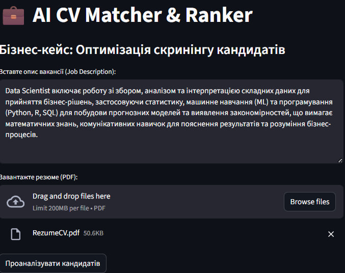
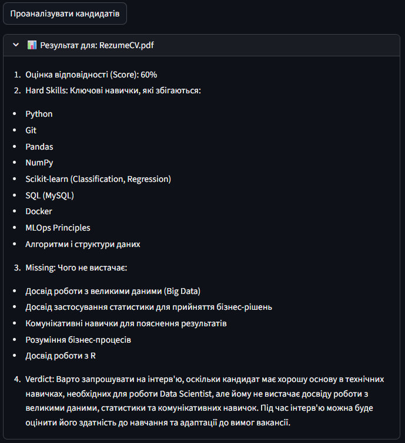

# 💼 AI CV Matcher & Ranker (HR-Tech Case Study)

An intelligent HR tool designed to automate the initial screening process. It uses **RAG (Retrieval-Augmented Generation)** to semantically compare candidate resumes against specific job descriptions.

## 📺 Project Demonstration
Below is a visual breakdown of how the system processes data and provides insights:

### 1. Input Interface
The user provides the target Job Description and uploads candidate resumes (PDF). The interface is designed for simplicity and efficiency, allowing for batch uploads.



### 2. AI-Driven Analysis & Verdict
The system leverages Llama 3.3 and RAG to generate a comprehensive report. It calculates a matching score, extracts identified hard skills, highlights missing requirements, and provides a final professional verdict on whether to interview the candidate.



---

## 🚀 Key Features
- **Semantic Matching:** Goes beyond keyword searching by using vector embeddings to understand the context of experience.
- **RAG Architecture:** Efficiently retrieves relevant sections of the CV to provide the LLM with the most important data.
- **Automated Verdicts:** Generates a professional match score (0-100%), identifies missing skills, and provides a hiring recommendation.
- **Batch Processing:** Handles multiple resumes simultaneously for rapid comparison.

## 🛠 Tech Stack
- **AI/LLM:** Llama 3.3 (via Groq Cloud), LangChain.
- **Vector Database:** Meta FAISS (Fast AI Similarity Search).
- **Embeddings:** Hugging Face (all-MiniLM-L6-v2).
- **Backend/UI:** Python 3.11, Streamlit.
- **Infrastructure:** Docker, Docker Compose.

## ⚙️ How to Run

1. **Clone the repository:**
   ```bash
   git clone [https://github.com/YourUsername/AI_CV_Matcher.git](https://github.com/YourUsername/AI_CV_Matcher.git)
   cd AI_CV_Matcher
   
2. **Set up environment variables:**
 ```TEXT
GROQ_API_KEY=your_key_here
```
3. **Build and run the Docker containers:**
   ```bash
   docker-compose up --build
   ```
4. **Access the application:**
Open your web browser and navigate to `http://localhost:8501`.
